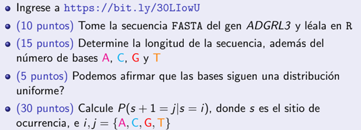
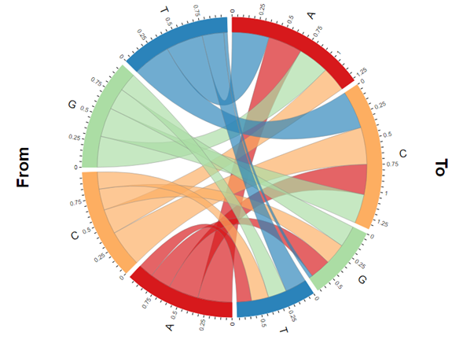
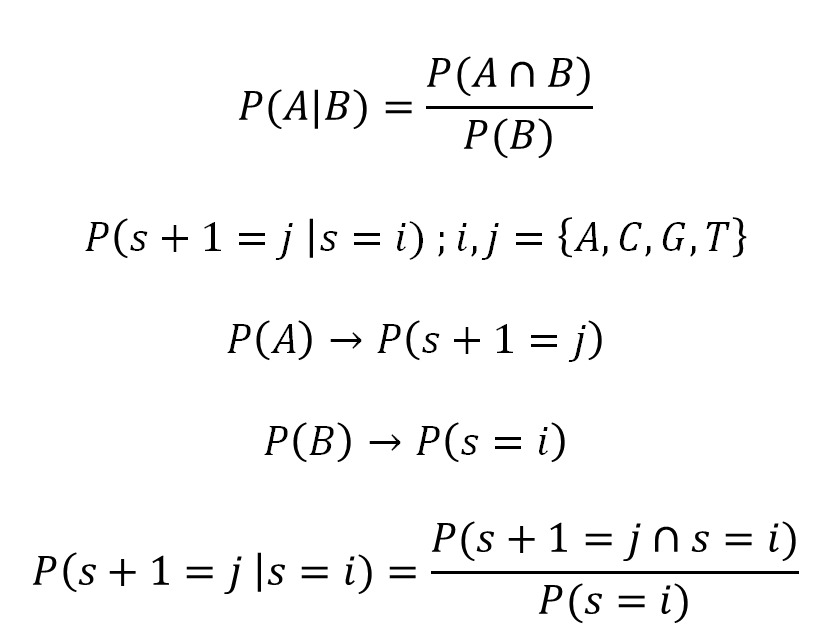
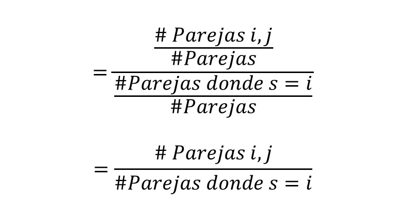

```{r setup, include=FALSE}
knitr::opts_chunk$set(echo = TRUE)
```

## CHALLENGE 1

El presente documento busca dar solución al siguiente problema propuesto.

{width=65%}

# Lectura de datos

Para leer la secuencia de datos, previamente extraímos la secuencia de la dirección URL y la depositamos en un bloc de notas y haciendo uso de las funciones ***scan()*** y ***strsplit()***  hicimos la lectura del .txt

```{r}
## Lectura de datos
datos <- scan("gen.txt", what = character())
splitdatos <- strsplit(datos, split = character())

```
# Longitud de datos y frecuencia de las bases
```{r, echo= F}
cont <- 0
contA <- 0
contT <- 0
contG <- 0
contC <- 0
j <- as.numeric(length(datos))
for (i in 1:j) {
cont <- cont + nchar(datos[i])
contA <- contA + sum(splitdatos[[i]] == "A")
contT <- contT + sum(splitdatos[[i]] == "T")
contG <- contG + sum(splitdatos[[i]] == "G")
contC <- contC + sum(splitdatos[[i]] == "C")
}
```
El número total de bases encontradas en el gen fue de `r cont`. La frecuencia de las bases presentes en la muestra del gen se muestra en la siguiente tabla
```{r, echo=F}
Bases <- c("A", "T", "G", "C")
Frecuencias <- c(contA, contT, contG, contC)
datosbase <- data.frame(Bases,Frecuencias)
datosbase
```

# ¿Sigue una distribución uniforme?

Si bien en casos de verificación de que un conjunto de datos sigue una distribución especifica lo más ortodoxo sea una prueba de bondad de ajuste, un buen primer indicativo puede ser un gráfico de los datos.

```{r, echo= F, warning= F}
library (ggplot2)
ggplot(datosbase) + geom_col(aes(x = Bases, y = Frecuencias,
                         fill = Bases), colour = "gray15", alpha=0.75)+
  ylab("Porcentaje") + geom_text( aes(x = Bases,y = Frecuencias*0.85,
                                      label = Frecuencias) )+
  labs(fill="Bases")+
  scale_fill_brewer(palette = "Spectral",type = "div", name="Base") + theme_bw()
```

Según el gráfico presentado no podemos afirmar que los datos de la muestra del gen sigan una distribución uniforme.

# Calculo de la probabilidad condicional

Las probabilidades de que dada una base *i* en la siguiente posición se encuentre una base *j* donde *i,j* = A,C,T,G se muestra en la siguente tabla, siendo *i* las filas y *j* las columnas.

```{r, echo = F}
tabla_conteo <- matrix(0, nrow = 4, ncol = 4)
row.names(tabla_conteo) <- Bases
colnames(tabla_conteo) <- Bases

ant_s <- "A"
for (i in 1:8319) {
  for (j in 1:70) {
    if (i==1 & j ==1) {
      next
    }
    s <- splitdatos[[i]][j]
    
    if (ant_s == "A") {
      ant_s <- 1
    } else if (ant_s =="T") {
      ant_s <- 2
    } else if (ant_s =="G") {
      ant_s <- 3
    } else if (ant_s =="C") {
      ant_s <- 4
    }
    
    if (s == "A") {
      s <- 1
    } else if (s =="T") {
      s <- 2
    } else if (s =="G") {
      s <- 3
    } else if (s =="C") {
      s <- 4
    }
    
    tabla_conteo[ant_s,s] <- (tabla_conteo[ant_s,s]+1)
    ant_s <- splitdatos[[i]][j]
  }
  
}
for (i in 1:4) {
  tabla_conteo[i,] <- tabla_conteo[i,] / sum(tabla_conteo[i,])
}
tabla_conteo
```
También podemos presentar esta información de manera más gráfica con en el siguiente diagrama de Chord.

<center>
{width=80%}
</center>

La fundamentación teorica de dicha tabla se basa escencialmente en la aplicación del teorema de Bayes, de la siguiente manera:

{width=45%}

{width=40%}


