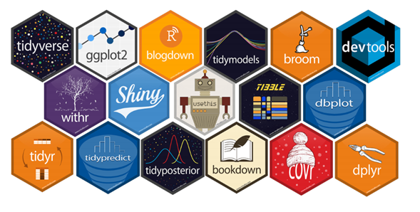
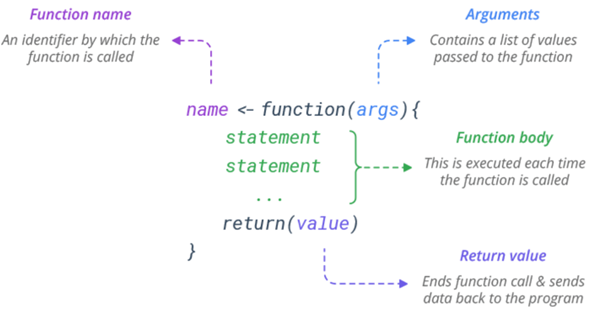

<div align="center">
  <h1>Curso Applied Data Science con R</h1>
</div>
<div align="center"> 
  
</div>

# Introduccion al documento 
El contenido de este documento esta basado en mis apuentes del curso del mismo nombre dictado por [Jorge Velez](http://jivelez.github.io/) en la [Universidad del Norte](https://www.uninorte.edu.co/).

# Tabla de contenido
  - [Introducción](#Introduccion)
      - [Introducción a R/RStudio](#Introducción-R-y-RStudio)
      - [Lectura, tipos y estructuras de datos, y operadores](#Lectura-de-datos)
      - [R markdown](#Rmarkdown)
      - [Data Science I](#DS1)
      - [Data Science II](#DS2)
  - [Análisis y vistualización](#AnalisisyVis)
      - [Analisis exploratorio de datos I](#AED1)
      - [Analisis exploratorio de datos II](#AED2)
      - [Gráficos 1D/2D/3D](#Graficos)
      - [Tablas de Contigencia](#Tablas-contingencia)
      - [Prueba de Hipotesis](#Prueba-de-Hipoteisis)
  - [Modelos Predictivos](#ModPred)
      - [Regresión Lineal Simple y Multiple](#RLSyM)
      - [Bootstrap](#Bootstrap)
      - [Regresión Logística](#Rlog)
      - [Regresión Poisson](Rpois)
      - [Regresión Beta](#Rbeta)
      - [Regresión Gamma](#Rgam)
      - [Classification and Regression Trees](#CART)
      - [Random Forest](#RF)
      - [Support Vector Machine](#SVM)
      - [Neural Networks](#NN)
  - [Métodos Cuantitativos en Alta Dimensión](#MetCuantAD)
      - [Principal Component Analysis](#PCA)
      - [Multidimensional Scaling](#MDS)
      - [Clustering](#Cluster)
  - [Tópicos Avanzados](#TA)
      - [Text mining](#Textmining)
      - [Principios de Geoanalítica](#Geoanalitica)
      - [Automatización de Reportes](AutReports)

# Introducción R y RStudio
  ## ¿Qué es R?
  <div align= "center">
    
  </div>  

  [R](https://www.youtube.com/watch?v=XcBLEVknqvY) es un entorno de programación y lenguaje para el análisis gráfico y **estadístico** de *datos* que fue creado por [Robert Gentleman](https://en.wikipedia.org/wiki/Robert_Gentleman_(statistician)) y [Ross Ihaka](https://en.wikipedia.org/wiki/Ross_Ihaka) en Agosto de 1993.
  Este es un lenguaje orientado a objetos y es multiplataforma, es similar al lenguaje S, pero bajo licencia GNU. Proporciona una gran cantidad de métodos estadísticos y gráficos, además de ser altamente extendible.
  ## ¿Qué es RStudio?
  <div align= "center">
    
  </div>

  [RStudio](https://www.youtube.com/watch?v=XcBLEVknqvY) es el entorno de desarrollo integrado (IDE). Este incluye una consola, un editor de sintaxis resaltado y soporta la ejecución directa del codigo, así como herramientas para gráficos, historial de acciones, workspace, etc.

  Análogamente R sería como el motor de un carro, y RStudio sería el "cascarón" y resto de feautres del carro. Sin el motor, el carro no funciona, pero sin el cascaron el motor si puede funcionar.

  ## Paquetes de R    
  Los paquetes o *packages* son una colección de funciones y conjuntos de datos que ayudan a potencializar las funcionalidades de R, cada paquete tiene su documentación. A día de hoy existen más de 17000 paquetes, algunos ejemplos conocidos son: MASS, ggplot2, shiny, caret, entre otros.
  <div align= "center">
    
  </div>

  Los paquetes se encuentran en **repositorios** los principales repositorios son: CRAN (Repositorio Oficial), Github y Bioconductor. Los paquetes se descargan, se instalan, se cargan y luego se usan.

  Las instrucciones que escribir son:
  ```{r}
    install.packages('YourPackageName', dependencies = TRUE)
    require(YourPackageName)
    update.packages(ask = FALSE)
    library(YourPackageName)
  ```
  La diferencia entre *require()* y *library()* es que el primero devuelve un mensaje invisible o *ghost value* que entrega True o False si el paquete está instalado o no. Mientras que *library()* sirve para cargar un paquete ya instalado.  
  ## ¿Como se leen datos en R?
  En R existen funcionalidades para leer casi cualquier tipo de datos, algunas funciones clave son:
  ```{r}
  scan()
  read.table()
  read.csv()
  readLines()
  read.xls() #del paquete gdata
  fread() #del paquete data.table
  ```
  Además podemos leer datos desde una URL, de la siguiente manera:
  ```{r}
  ## lectura de datos
  url <- "https://bit.ly/2RmO1OR"
  datos <- read.table(url, header = TRUE)
  ```
  Recordemos que R es un lenguaje orientado a objetos, y es importante conocer la estructura del objeto para saber que funciones podemos aplicarle, esto se puede saber utilizando la siguiente función:
  ```{r}
  str(objeto)
  ```
  ## Definición y creación de funciones
  Las funciones son un conjunto de instrucciones organizadas guardadas en un objeto que el intérprete de R puede entender y completar una acción con los argumentos o inputs de dicha función. Se pueden construir funciones propias o usar las que ya están creadas en los diferentes paquetes, algunos ejemplos son:
  ```{r}
  sqrt()
  mean()
  summary()
  rowSums()
  colSums()
  ``` 
  Las funciones siguen la siguiente estructura:
   <div align= "center">
    
  </div>

  Ejemplo de creación de una función:
  ```{r}
  ## Cálculo del coeficiente de variación
  CV <- function(x, na.rm = TRUE){
  m <- mean(x, na.rm = na.rm)
  s <- sd(x, na.rm = na.rm)
  s/m
  }
  ```


