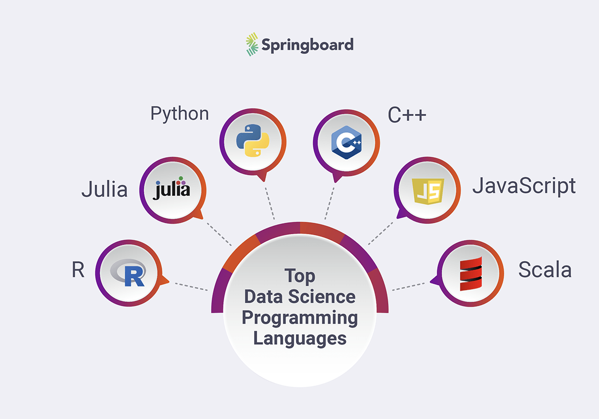

<div align="center">
  <h1>Curso Applied Data Analytics con R</h1>
</div>
<div align="center"> 
  
</div>

# Introduccion al documento 
El contenido de este documento esta basado en mis apuntes del curso del mismo nombre dictado por [Jorge Velez](http://jivelez.github.io/) en la [Universidad del Norte](https://www.uninorte.edu.co/).

# Tabla de contenido
  - [Introducción](#Introduccion)
      - [Introducción a R/RStudio](#Introducción-R-y-RStudio)
      - [Lectura, tipos y estructuras de datos, y operadores](#Lectura-tipos-y-estructuras-de-datos-y-operadores)
      - [R Markdown](#R-Markdown)
      - [Data Science I](#Data-Science-I)
      - [Data Science II](#Data-Science-II)
  - [Análisis y vistualización](#AnalisisyVis)
      - [Análisis exploratorio de datos I](#Análisis-exploratorio-de-datos-I)
      - [Análisis exploratorio de datos II](#AED2)
      - [Gráficos 1D/2D/3D](#Gráficos)
      - [Tablas de Contigencia](#Tablas-contingencia)
      - [Prueba de Hipotesis](#Prueba-de-Hipótesis)
  - [Modelos Predictivos](#ModPred)
      - [Regresión Lineal Simple y Multiple](https://github.com/calvarezr7/Curso_AppliedDataAnalytics/blob/master/Regresi%C3%B3n_LauraZapata/Regresi%C3%B3nLinealMultiple.pdf)
      - [Bootstrap](#Bootstrap)
      - [Regresión Logística](https://github.com/calvarezr7/Curso_AppliedDataAnalytics/blob/master/Regresi%C3%B3n_LauraZapata/Regresi%C3%B3nLogistica.pdf)
      - [Regresión Poisson](https://github.com/calvarezr7/Curso_AppliedDataAnalytics/blob/master/Regresi%C3%B3n_LauraZapata/Regresi%C3%B3nPoisson.pdf)
      - [Regresión Beta](#Rbeta)
      - [Regresión Gamma](#Rgam)
      - [Classification and Regression Trees](#CART)
      - [Random Forest](#RF)
      - [Support Vector Machine](#SVM)
      - [Neural Networks](#NN)
  - [Métodos Cuantitativos en Alta Dimensión](#MetCuantAD)
      - [Principal Component Analysis](#PCA)
      - [Multidimensional Scaling](#MDS)
      - [Clustering](#Cluster)
  - [Tópicos Avanzados](#TA)
      - [Text mining](#Textmining)
      - [Principios de Geoanalítica](#Geoanalitica)
      - [Automatización de Reportes](AutReports)

# Introducción R y RStudio
  ## ¿Qué es R?
  <div align= "center">
    
  </div>  

  [R](https://www.youtube.com/watch?v=XcBLEVknqvY) es un entorno de programación y lenguaje para el análisis gráfico y **estadístico** de *datos* que fue creado por [Robert Gentleman](https://en.wikipedia.org/wiki/Robert_Gentleman_(statistician)) y [Ross Ihaka](https://en.wikipedia.org/wiki/Ross_Ihaka) en Agosto de 1993.
  Este es un lenguaje orientado a objetos y es multiplataforma, es similar al lenguaje S, pero bajo licencia GNU. Proporciona una gran cantidad de métodos estadísticos y gráficos, además de ser altamente extendible.
  ## ¿Qué es RStudio?
  <div align= "center">
    
  </div>

  [RStudio](https://www.youtube.com/watch?v=XcBLEVknqvY) es el [entorno de desarrollo integrado (IDE)](https://github.com/calvarezr7/Curso_AppliedDataAnalytics/blob/master/Contenido%20practico%20del%20curso/docs/rstudio-ide.pdf). Este incluye una consola, un editor de sintaxis resaltado y soporta la ejecución directa del codigo, así como herramientas para gráficos, historial de acciones, workspace, etc.

  Análogamente R sería como el motor de un carro, y RStudio sería el "cascarón" y resto de feautres del carro. Sin el motor, el carro no funciona, pero sin el cascaron el motor si puede funcionar.

  ## Paquetes de R    
  Los paquetes o *packages* son una colección de funciones y conjuntos de datos que ayudan a potencializar las funcionalidades de R, cada paquete tiene su documentación. A día de hoy existen más de 17000 paquetes, algunos ejemplos conocidos son: MASS, ggplot2, shiny, caret, entre otros.
  <div align= "center">
    
  </div>

  Los paquetes se encuentran en **repositorios** los principales repositorios son: CRAN (Repositorio Oficial), Github y Bioconductor. Los paquetes se descargan, se instalan, se cargan y luego se usan.

  Las instrucciones que escribir son:
  ```{r}
    install.packages('YourPackageName', dependencies = TRUE)
    require(YourPackageName)
    update.packages(ask = FALSE)
    library(YourPackageName)
  ```
  La diferencia entre *require()* y *library()* es que el primero devuelve un mensaje invisible o *ghost value* que entrega True o False si el paquete está instalado o no. Mientras que *library()* sirve para cargar un paquete ya instalado.  

  ## Definición y creación de funciones
  Las funciones son un conjunto de instrucciones organizadas guardadas en un objeto que el intérprete de R puede entender y completar una acción con los argumentos o inputs de dicha función. Se pueden construir funciones propias o usar las que ya están creadas en los diferentes paquetes, algunos ejemplos son:
  ```{r}
  sqrt()
  mean()
  summary()
  rowSums()
  colSums()
  ``` 
  Las funciones siguen la siguiente estructura:
   <div align= "center">
    
  </div>

  Ejemplo de creación de una función:
  ```{r}
  ## Cálculo del coeficiente de variación
  CV <- function(x, na.rm = TRUE){
  m <- mean(x, na.rm = na.rm)
  s <- sd(x, na.rm = na.rm)
  s/m
  }
  ```
# Lectura, tipos y estructuras de datos, y operadores 
  ## ¿Como se leen datos en R?
  En R existen funcionalidades para leer casi cualquier tipo de datos, algunas funciones clave son:
  ```{r}
  scan()
  read.table()
  read.csv()
  readLines()
  read.xls() #del paquete gdata
  fread() #del paquete data.table
  ```
  Cada función es ideal para ciertos tipos de formato, *scan()* por lo general se usa para datos no estructurados, *read.table()* puede leer gran parte de datos estructurados. De hecho, *read.csv()* o *read.csv2()* son casos especiales de *read.table()*. **Sugerencia:** Revisar la información de la función para saber que separador (*sep=*) utiliza por defecto.

  Además podemos leer datos desde una URL, de la siguiente manera:
  ```{r}
  ## lectura de datos
  url <- "https://bit.ly/2RmO1OR"
  datos <- read.table(url, header = TRUE)
  ```
  Recordemos que R es un lenguaje orientado a objetos, y es importante conocer la estructura del objeto para saber que funciones podemos aplicarle, esto se puede saber utilizando la siguiente función:
  ```{r}
  str(objeto)
  ```
  ## Tipos de datos 
  En R existen múltiples tipos de datos y los básicos son:
  * character : "a", "srw"
  * numeric : 7, 10.5
  * integer : 3L
  * logical : TRUE, FALSE
  * complex : 1+4i
  
  Para verificar o conocer que tipo de dato es un objeto podemos utilizar las funciones *typeof()* o *class()*
  ```{r}
  typeof(object)
  class(object)
  ```
  ## Estructuras de datos 
  En computer science una estructura de datos es una forma particular de organizar los datos en una computadora para trabajarlos de manera eficiente. En R se manejan diferentes estructuras de datos como: 
   * atomic vectors
   * list
   * matrix
   * data.frame
   * factors  
  
  Ejemplos:
  ```{r}
  ## ejemplo 1
  z <- c("Camilo", "Alvarez", "Rios")
  z
  ## agregar una entrada al inicio
  (z2 <- c('Jesus', z))
  length(z2) #longitud del objeto
  ## una matriz
  (M <- matrix(1:20, ncol = 5, byrow = TRUE))
  ## vectores con valores NA
  x <- c(0.5, NA, 0.7)
  y <- c(TRUE, FALSE, NA)
  ```
  ## Operadores
  * **<**   :  Menor que
  * **<=**  :  Menor o igual que
  * **>**   : Mayor que
  * **>=**  : Mayor o igual que
  * **==**  : Igual a
  * **!==** : Diferente a
  * **!x**  : No X
  * **x|y** : x Ó y
  * **x & y** : x Y y
  * **x%%y**  :  Modulo (ej: 5%%2 es 1 ) 
  * **x%/%**  :  División entera (ej: 5%/%2 es 2)
  
# R Markdown
Uno de los desafíos en la analítca de datos es compartir los resultados en informes de forma eficiente de manera que no se tenga que reconstruir todo el informe cuando ocurra una correción de datos, afortunadamente tenemos un concepto que nos ayuda en estas situaciones llamado **investigación reproducible**. 
<div align= "center">
    
  </div>

En R existe un paquete que nos ayuda en este propisto de **Comunicar**, llamado [rmarkdown](https://github.com/calvarezr7/Curso_AppliedDataAnalytics/blob/master/Contenido%20practico%20del%20curso/docs/rmarkdown-spanish.pdf). 

 <div align= "center">
    
  </div>

R Markdown soporta diferentes formatos:
 * HTML
 * PDF
 * MS Word
 * Beamer
 * Books
 * Dashbords

También es posible incluir ecuaciones utilizando sintaxis de *LATEX*

Para empezar a crear un archivo de R Markdown (que tiene por extensión ***.Rmd***) se debe seguir la siguiente ruta dentro de RStudio:
  ```
  File > New File > R Markdown...
  ```

# Data Science I
  En los ultimos años se ha vuelto popular la frase de Clive Humby "Data is the new oil" y nos ha hecho caer en cuenta en lo importante que están siendo los datos en la actualidad, y  se hablan mucho de diferentes términos especialmente de *Data Science*. Pero, ¿Que es realmente [Data Science](https://www.youtube.com/watch?v=X3paOmcrTjQ)?. 

  Data Science es un conjunto de disciplinas que te dan las herramientas necesarias para transformar y extraer datos crudos y convertirlos en información util. A esto se le relaciona con el cuarto paradigma de [Jim Gray]("https://en.wikipedia.org/wiki/Jim_Gray_(computer_scientist)") (data-driven).

  ## Flujo de trabajo en D.S.

  El work flow en ciencia de datos consiste básicamente en:
  - Primeramente y probablemente lo más importante es **entender el negocio** para saber en que contexto vamos a trabajar los diferentes modelos y las diferentes variables que influyen.
  - **Descubrir** cuales son los datos que tenemos y cuales son los que no tenemos para buscar una manera de conseguirlos y así armar una base de datos completa que nos permita poco a poco armar el conocimiento. 
  - **Preparar** los datos de forma que se facilite su análisis.
  - **Modelamiento**. Crear modelos estadísticos, que de los muchos tipos que hay se debera definir cual es el ideal de acuerdo a la complejidad del negocio y al riesgo dispuesto a correr.
  - **Validar** que tan bueno es el modelo para predecir datos ya vistos y no vistos, a través de partición de datos.
  -  Calcular ciertas métricas que permitan **evaluar** que el modelo es bueno.
  - **Desarrollo de la solución.** Como se entrega y como es la presentación de la solución (backend y frontend).
  - Un paso transversal a todos los anteriormente mencionados está en ver como se puede hacer **optimización continua** de cada parte del workflow
 
  <div align= "center">
  <a href="http://www.anovaanalytics.com/data-science-consulting/">Imagen resumen</a> 
  </div>
 
  <div align= "center">
    
  </div>
  
  ## Roles en Data Science
  Como vimos en el workflow son muchas las diferentes funciones que se llevan a cabo en el proceso de ciencia de datos y es por esto que ultimamente no se habla de "*el Data Scientist*" sino de *equipos de Data Science* donde diferentes personas pueden tomar diversos [roles](https://www.mygreatlearning.com/blog/different-data-science-jobs-roles-industry/) según su especialidad. 

  A manera personal, me gusta mucho la explicación y clasificación de los roles en el siguiente [diagrama](https://blog.acamica.com/oportunidades-de-carrera-en-ciencia-de-datos/)
  
  <div align= "center">
    
  </div>

  ## Lenguajes
  En Data Science los lenguajes más populares son Python y R pero se puede hacer Data Science con muchos [otros lenguajes](https://in.springboard.com/blog/data-science-programming-languages/)
   <div align= "center">
    
  </div>

  ## ¿Que NO es Data Science?
  Es bueno aclarar que ciencia de datos NO se trata de:

  - **Machine Learning/ A.I.** : Si bien en el proceso de Data Science se pueden utilizar estas herramientas, es mucho más allá que eso.

  - **Graficar en Excel** : Aunque una parte importante de Data Science es la presentación de la información a través de gráficos (*Data visualization*) el hacer graficos en excel no se puede considerar hacer Data Science.

  - **Salvación de compañías**: Si la compañía no tiene una estructura para decidir y basarse en datos y los datos que tiene son basura lo que se obtendrá al analizar esos datos será basura (*Garbage in, Garbage out*)

  ## Aplicaciones
  
  [Algunas aplicaciones](https://strideitsolutions.co.uk/data-science-services-2/)

  <div align= "center">
    
  </div>


# Data Science II
## Tipos de Analítica
Los diferentes tipos de análisis que se pueden hacer, se pueden ver desde diferentes enfoques.
- **Descriptivo** : Explicar lo que ya ha sucedido, mirar distribuciones de los datos, como se comportan, gráficos, medidas de posición o dispersión, etc.
- **Diagnostica** : Una vez tenemos una variable respuesta, intentamos saber ¿Por qué pasó?
- **Predictiva** : A partir del conocimiento de lo que ocurrío y por qué ocurrío intentamos desarrollar modelos que nos digan que podría pasar si esas variables previamente identificadas toman valores particulares.
- **Prescriptiva** : A partir de la predicción, que se debe hacer desde ya para prepararse cuando se llegue a dicha predicción.

<div align = "center">
  
</div>

Además existe una quinta área incipiente denonminada [**Analítica cognitiva**](https://www.ulster.ac.uk/cognitive-analytics-research/cognitive-analytics) 

## Road map
Una [ruta](https://www.freecodecamp.org/news/data-science-learning-roadmap/) recomendable para empezar en data science en 2021

<div align = "center">
  
</div>


# Análisis exploratorio de datos I

El análisis exportorio de datos o EDA hace parte fundamental del trabajo de ciencia de datos y hace parte tanto de la analítica descriptiva y la analítica diagnostica, desde el punto de vista estadístico, se utilizan métodos y teorias desarrollados para recolectar, describir, analizar e interpretar información para tomar decisiones en presencia de variabilidad e incertidumbre.

Es importante: 
- Conocer las reglas y los métodos usados para tratar los datos (ETL)
- Evaluar y cuantificar la importancia de los resultados estadísticos en contexto.
- Entender mejor el fenómeno de interés.
- Proporcionar una visión clara de los datos disponibles.

Usos generales:
- Informar al publico.
- Hacer comparaciones.
- Justificar una afirmación.
- Establecer relaciones entre factores/variables.
- Pronosticar posibles resultados.

[Inducción, Deducción y Estadísticas](https://www.ajibot.com/blog/deduction-vs-induction-vs-abduction). En análitica de datos generalmente nos movemos en el campo de inducción (inferencial), donde tenemos unos datos o unas observaciones, con métodos análiticos encontramos algún patron, con ese patron generamos unas hipotesis y con esta hipotesis generamos una teoría. Esto no quiere decir que no se pueda utilizar metodos deductivos para los diferentes análisis.

<div align = "center">
  
</div>

Una buena forma de entender mejor los datos es por medio de los gráficos, sin embargo es importante conocer dos factores clave para escoger el gráfico ideal: **El tipo de variable** y **La escala de medida**

<div align = "center">
  
</div>


Explorartory Data Analysis (EDA) es un conjunto de recnicas que ayudan al investigador a entender los datos quetiene a la mano y la potencial relación con las variables analizadas. Los pasos recomendados son los siguientes:

- Preparar los datos para aplicar alguna técnica estadística.
- Usar gráficos descriptivos.
- Estudiar asociaciones entre variables usando herramientas gráficas y correlaciones.
- Evaluar si los supuestos que se tienen sobre los datos, se cumplen o no. Algunos supuestos básicos pueden ser normalidad, linealidad, homocedasticidad.
- Evaluar, si es necesario, el impacto de datos faltantes.

# Gráficos

Una buena fuente de inspiración para la creación de gráficos puede ser la página [R Graph-Gallery](https://www.r-graph-gallery.com/)

## Gráficos en 1D
Este tipo de gráficos nos proporcionan información sobre la distribución de los datos, el comportamiento de una variable en el tiempo o por algún grupo de interés.

Estos pueden servir muy bien para un *primer acercamiento* a los datos.

Ejemplos:
- Dotcharts
- Boxplots
- Beanplots
- Violin plots
- Histograms/barplots
- Line plots (para Series de Tiempo)
- ECDF
- Ridgeline plot

## Gráficos en 2D
Este tipo de gráficos permiten explorar la relación entre dos variables cuantitativas, determinar si existen diferencias en la distribución/promedio de una variable cunatitativa vs. niveles de una variable cualitativa, y también identificar regiones de mayor concentración de datos.

Ejemplos: 
- Scatterplots
- Boxplots y similares
- Heatmaps

## Gráficos en 3D
Aunque este tipo de gráficos son menos frecuentes, se suelen usar en datos de estructura compleja (resultados de PCA y MDS) y se utilizan para explorar patrones en tripletas de variables e identificar regiones/elipses de mayor densidad de los datos. También se puede dar el caso de tener una cuarta variable de los datos que se trate de una variable categórica. 

# Prueba de Hipótesis

Las pruebas de hipótesis son una herramienta  de la estadística inferencial para determinar  el valor que podría tomar un parámetro en una población a partir de información de una muestra.

Se compone de :
- Una hipótesis nula (representada como H0) que asume que nada interesante ocurre, es decir que un parámetro es **igual** a un valor.
- Una hipótesis alternativa (representada como H1) que asume una acción (mayor que, menor que, diferente) sobre el parametro y el valor asociado. Dependiendo de la acción la curva puede tener diferentes formas (Cola derecha, cola izquierda, dos colas, respectivamente.)

## Tipos de errores
  La realización de estas pruebas de hipótesis tienen asociados dos tipos de errores:
  - Error tipo I (Alfa): Probabilidad de rechazar la hipótesis nula (H0), cuando en realidad es verdadera.
  - Erro tipo II (Beta): Probabilidad de no rechazar la hipótesis nula (H0), cuando en realidad es falsa.
  
  En estás pruebas solo se puede controlar la probabilidad de error tipo I. Además, el calculo de (1 - Beta) se conoce como la potencia y es la capacidad que tiene la prueba de hipótesis de detectar una diferencia cuando realmente existe.

## Tipos de pruebas de hipótesis
  - Pruebas para 1 muestra
  - Pruebas para 2 muestras:
    - Dependientes
    - Independientes 

# Bootstrap

Es una técnica que consiste en hacer remuestreo de una muestra para agregar variabilidad y así estudiar la variabilidad de la población (a la cual no se puede acceder) a partir de esa primera muestra.
El bootstrap permite calcular medidas de precisión para estimadores muestrales. El problema principal es que depende de la calidad de la muestra.

<div align = "center">
  
</div>

  ```
  # Sea x un vector que contiene la muestra
  replicate(100, sample(x, replace = TRUE))
  # Se está haciendo un remuestreo de 100 muestras con remplazo a partir de la muestra x
  ```
 ```
  # Ejemplo para mediana manual
  ## algunos datos
  x <- c(7,6,12,11,17,15,8,10)
  ## valor muestral
  median (x)
  ## Estimación int. conf. 95% para el valor minimo
  B <- 1000
  mediana.boot <- replicate (1000, {
    xsamp <- sample(x, replace = TRUE)
    median(xsamp)
  })
  quantile(mediana.boot, probs = c(0.025, 0.975))
  ```  
  ```
  # Ejemplo utilizando el paquete boot
  # Sea f una función previamente creada que reciba como parametros el vector de datos y el index.
  f <- function(x, index) sd(x[index])/mean(x[index])

  #La función boot recibe el dataframe, la función y el numero de repeticiones (siempre es -1)
  boot(x, f, R = 999)
  ```


 


